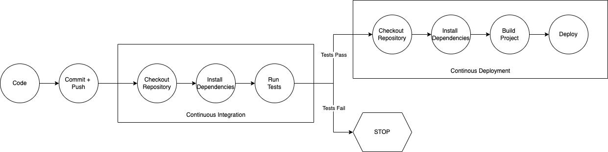

# Ammolite: the frontend for the ammonite-profiler

Ammolite is a client for the ammolite-profiler GitHub action and the Obsidian REST API. It was built in typescript using the nextjs framework. Next.js is an open-source web development framework built on top of Node.js enabling React-based web applications functionalities such as server-side rendering and generating static websites.

## Quickstart

1. clone the [repository]
2. `cd ammolite`
3. `npm install`

Development: \
4. `npm install`
5. `npm run dev`
6. Open [http://localhost:3000](http://localhost:3000) with your browser to see the result.

Deploy on Vercel:\
4. `npm run build`
5. `vercel --prod`
6. Open the given link to see your app in production

## Deployment Pipeline
The app is deployed on [Vercel]. CICD is handled by using GitHub actions.

## Relevant Documentations
* [Next.js Documentation]
* [Vercel] Deployment Documentation

[Next.js Documentation]: <https://nextjs.org/docs>
[Vercel]: <https://vercel.com/docs/concepts/next.js/overview>
[repository]: <https://github.com/pdettmann/ammolite>
